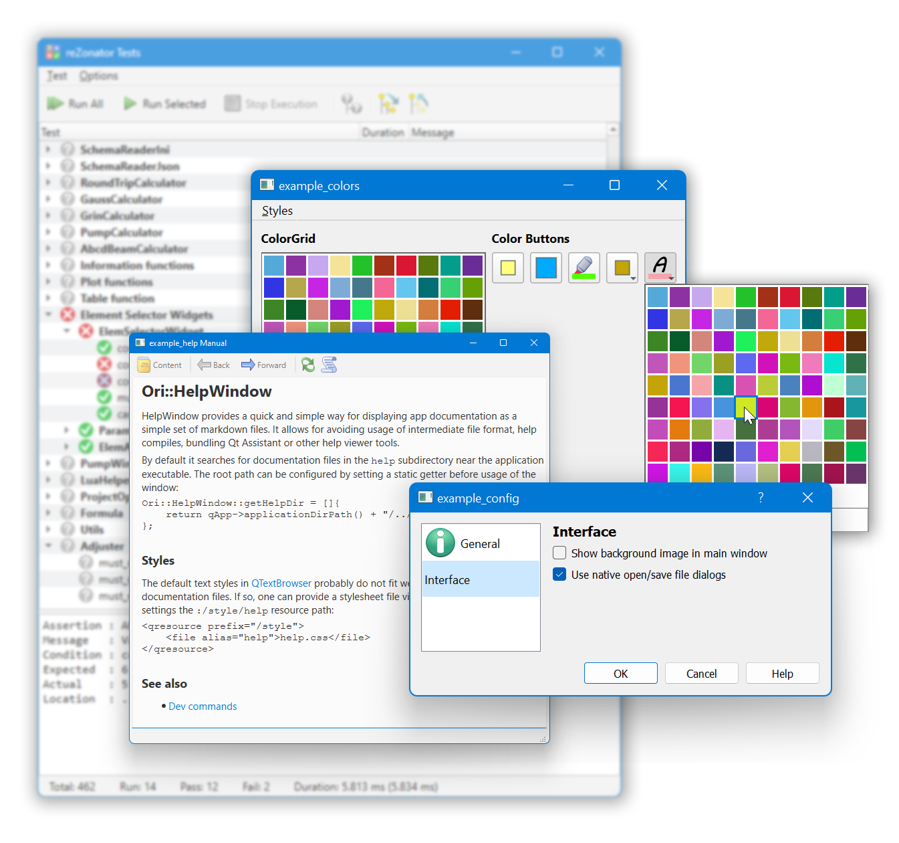

# orion-qt

A widgets, tools, and helper library for Qt. 

## Usage

Historically, it's intended to be used as a submodule in a projects subdirectory `libs/orion`. It doesn't really matter but most of examples suppose this location.

```bash
cd /YOUR/PROJECT/DIR
git submodule add https://github.com/orion-project/orion-qt libs/orion
git submodule update --init
```

Add include file in the `.pro` file of your Qt project:

```cmake
ORION = $$_PRO_FILE_PWD_/libs/orion
include($$ORION/orion.pri)
```

or in `CMakeLists.txt`:

```cmake
add_subdirectory(libs/orion)

target_link_libraries(${PROJECT_NAME} PRIVATE
    # other libs ...
    orion
) 

# an additional step to build lib's icons into the app
add_executable(${PROJECT_NAME}
    # other source files ...
    libs/orion/resources.qrc
) 

```

### Optional components

Some modules require additional dependencies and are not needed for every application. Such optional parts are disabled by default and should be enabled explicitly in particular project files that are going to use them. For example the [spell checker](./tools/OriSpellcheck.md) module requires downloading of the Hunspell code and dictionaries. To use the module, include its code in the target `.pro` file explicitly:

```cmake
include($$ORION/orion.pri)
include($$ORION/orion_spellcheck.pri)
```

or in `CMakeLists.txt`:

```cmake
set(ORI_WITH_SPELLCHECK ON)
add_subdirectory(libs/orion)
```


## Components

Some useful things are

- Widgets
    - [CodeEditor](./widgets/OriCodeEditor.md)
    - [PopupMessage](./widgets/OriPopupMessage.md)
- Tools
    - [HelpWindow](./tools/OriHelpWindow.md)
    - [Highlighter](./tools/OriHighlighter.md)
    - [Spellcheck](./tools/OriSpellcheck.md)
- [Testing](./testing/README.md)

*TODO:* describe more components and add links here


