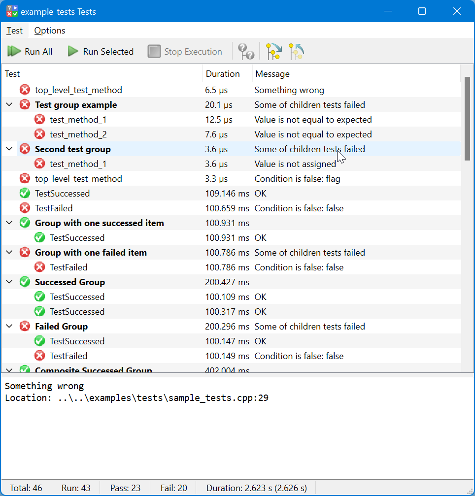

# `Ori::Testing` Example

A simple starter-point example of usage of [Ori::Testing](../../testing). See [here](https://github.com/orion-project/rezonator2/tree/master/src/tests) for a complex real example.

