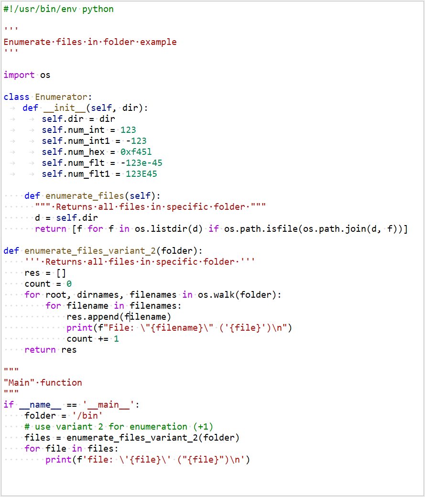

# Syntax highlight rules

Syntax highlight rules for [Ori::Highlighter](../../tools/OriHighlighter.cpp).

## How to use

Include rule files as resources into the app's resource file:

```xml
<qresource prefix="/syntax">
    <file alias="css">../libs/orion/syntax/css.ohl</file>
    <file alias="qss">../libs/orion/syntax/qss.ohl</file>
    <file alias="py">../libs/orion/syntax/python.ohl</file>
</qresource>
```

Then just attach it to any editor:

```cpp
#include "tools/OriHighlighter.h"

auto editor = new QPlainTextEdit;
Ori::Highlighter::setHighlighter(editor, ":/syntax/py");
```

This is how it should look like:



## See also

- [Highlighter Rule Editor](../utils/ohl_editor/README.md)
