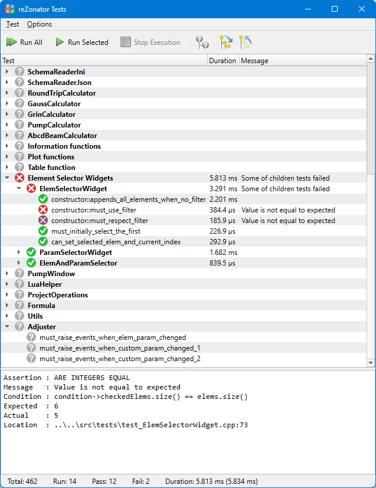

# `Ori::Testing`

A simple testing framework.

The main goal is to have a testing functionality that can be build right into the application. It's not intended to be used in CI or any kind of automation, there are many other good things for that. Though it can be run in non-ui mode so probably could bu adjusted for that when really needed.

## Usage

Link to the framework sources in your project's `.pro` file:

```bash
ORION = $$_PRO_FILE_PWD_/libs/orion
include($$ORION/orion.pri)
include($$ORION/orion_testing.pri)

# Tests for orion-qt itself, optionally
include($$ORION/orion_tests.pri)  
```

*TODO:* add example for `CMakeLists.txt`

See a [starter example](../examples/tests) for how to add tests into an app. See [here](https://github.com/orion-project/rezonator2/tree/master/src/tests) for a complex real example.

