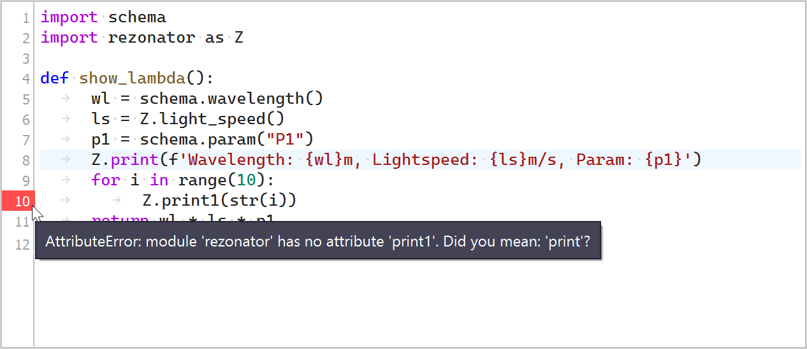
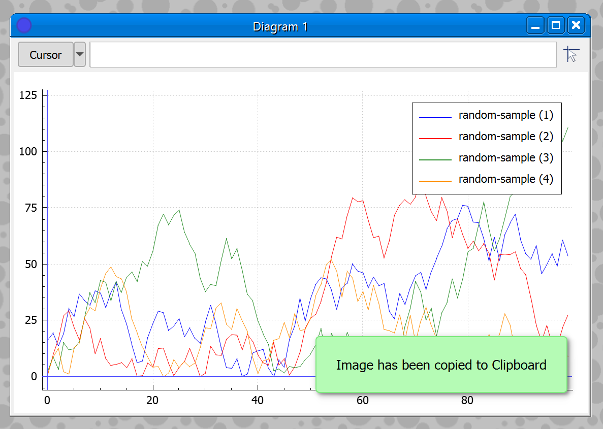

# Widgets

## [`Ori::Widgets::CodeEditor`](./OriCodeEditor.h)

A simple wrapper around QPlainTextEdit providing several additional features conventional for code editors

- line numbering
- current line highlighting
- line hints for error highlighting
- tab to space replacement
- selection (un)indentation
- automatic block indentation
- smart home key
- document normalization

Screenshot

### See also

- [Ori::Highlighter](../tools/README.md#orihighlighter)
- [Code editor example](../examples/coder/README.md)

## [`Ori::Gui::PopupMessage`](./OriPopupMessage.h)

Temporary popup message, automatically hidden by timeout.

Screenshot

